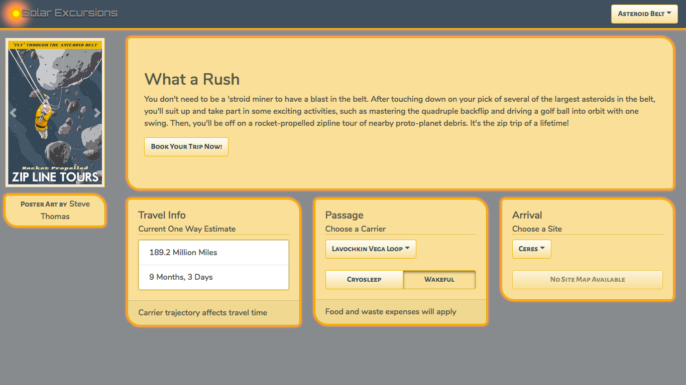

# Iterating a React Design - Final Codebase
## What is this?
In my article [Iterating a React Design with Styled Components](https://css-tricks.com/iterating-a-react-design-with-styled-components/), I create a booking page for a fictional space travel agency called Solar Excursions. The small, resource-starved dev team wants to create their own stying and components, but needs to deliver functionality in the short term. 

They choose to move quickly at first by using React-Bootstrap just to get something up on the screen. After their [first sprint](https://codesandbox.io/s/38my744q5m), they have a working, responsive page. However they see that they're building technical debt by having all their application components depend on React-Bootstrap, which will make it hard to refactor out later. 

During the [second sprint](https://codesandbox.io/s/xlrvn41n6p), they refactor to create a custom component kit. At first it just renames existing React-Bootstrap components, leaving the app looking the same. But now they've isolated the React-Bootstrap dependency to their kit. 

Finally, in their [third sprint](https://codesandbox.io/s/j7w7v4k67y), they add support for per-destination themes, and custostm styles that don't look like out-of-box React-Bootstrap anymore. 

View the final page [here](https://j7w7v4k67y.codesandbox.io/).

# Setup
## Install Node and npm
[Node](https://nodejs.org/en/download/) 10.15 or above (also installs npm)

## Install Node modules
cd path/to/iterating-react-design (the rest of this document assumes you are at this location)

`npm install`

## Build and Launch
`npm run start`
